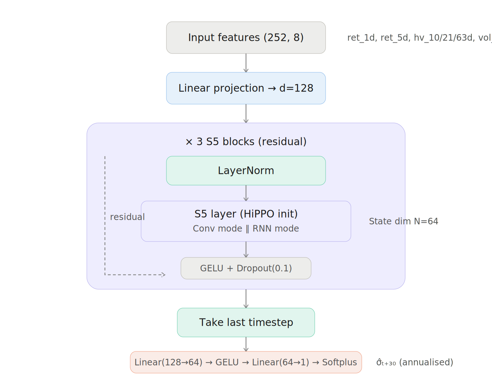
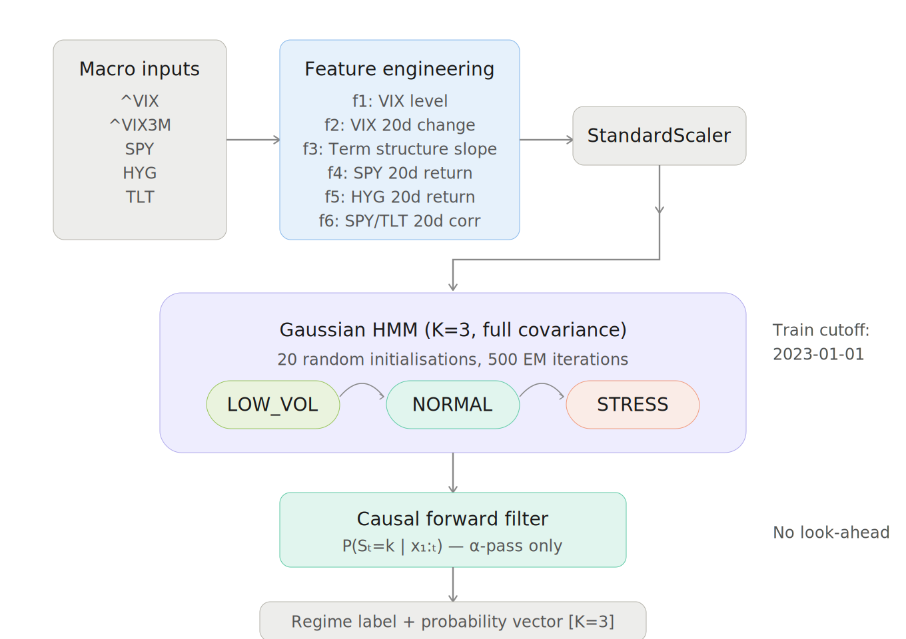
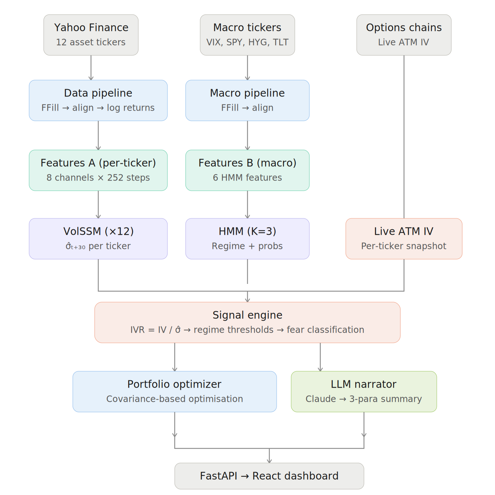

# AdvisorIQ — Portfolio Intelligence

**Hackathon submission: "Data in Finance"**

## VolSSM
<p align="center">
  
</p>

## HMM Vol Regime
<p align="center">
  
</p>

## Data Pipeline
<p align="center">
  
</p>

## Repository Structure

```
advisoriq/
├── config/
│   ├── settings.py       # All parameters: tickers, dates, thresholds, model hyperparams
│   └── clients.py        # 5 client profiles with distinct risk tolerances
├── src/
│   ├── models/
│   │   ├── vol_ssm.py    # Layer A: S5-based volatility forecaster 
│   │   └── hmm_regime.py # Layer B: HMM regime classifier 
│   ├── data/
│   │   ├── pipeline.py   # Data ingestion, cleaning, caching 
│   │   ├── features_a.py # 8-channel feature engineering for VolSSM
│   │   └── features_b.py # 6-feature macro engineering for HMM
│   ├── training/
│   │   ├── train_vol_ssm.py  # Per-ticker VolSSM training pipeline
│   │   └── train_hmm.py      # HMM regime classifier training
│   ├── inference/
│   │   ├── signal_engine.py  
│   │   └── optimizer.py      
│   ├── llm/
│   │   └── narrator.py       # LLM integration for client explanations + chatbot
│   └── app/
│       └── server.py         # FastAPI backend serving all endpoints
├── ui/
│   └── dashboard.jsx         # React dashboard with client cards + chatbot
├── scripts/
│   ├── train.py              # CLI: train all models
│   └── serve.py              # CLI: launch application
├── artifacts/                # Generated: model checkpoints, cached data
└── requirements.txt
```
